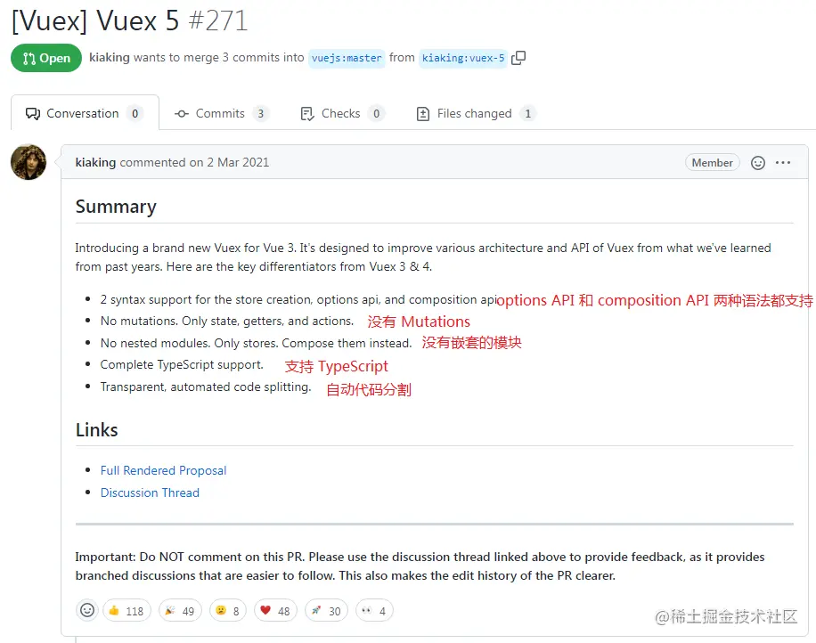

# pinia入门指北


[官网](https://pinia.vuejs.org/)

## pinia是个什么东西

### 前言

Pinia 是 Vue.js 团队成员专门为 Vue 开发的一个全新的状态管理库，并且已经被纳入官方 [github](https://link.juejin.cn/?target=https%3A%2F%2Fgithub.com%2Fvuejs%2Fpinia)。

为什么有了vueX，还要开发pinia?

这是vueX 5 的提案。



而pinia刚好符合vueX5提案的所有要求，事实上，pinia也是基于vueX对未来状态管理器的一种探索。

### 简介

Pinia.js 是新一代的状态管理器，由 Vue.js团队中成员所开发的，因此也被认为是下一代的 Vuex，即 Vuex5.x，在 Vue3.0 的项目中使用也是备受推崇。

```
Pinia刚开始只是一个实验，旨在重新设计Vue的Store在2019年11月左右可以使用Composition API的样子。从那时起，最初的原则仍然是相同的，但Pinia同时适用于Vue 2和Vue 3，并且不要求你使用composition API。
```


### 核心特性

#### state

state是pinia的核心部分，所有需要管理的状态属性都写到这里，和vueX的state差不多，是唯一存储能够存储数据的地方，并且具有响应式。

基本使用方式如下：

```js
import { defineStore } from 'pinia'

const useStore = defineStore('storeId', {
    return {
      counter: 0,
      name: 'Eduardo',
      isAdmin: true,
    }
  },
})
```

可以使用mapState() 引入多个数据，只能读取数据；

也可以使用mapWritableState() 引入多个数据，并且可以读取和修改数据。

修改数据

```js
// 1、可以直接以点操作符的方式修改
const store = useStore()：
store.counter++

// 2、可以使用$patch()
store.$patch({
  counter: store.counter + 1,
  name: 'Abalam',
})

// 3、也可以调用action里面的方法去修改
```

监听state的改变

```js
store.$subscribe((mutation, state) => {
  // import { MutationType } from 'pinia'
  mutation.type // 'direct' | 'patch object' | 'patch function'
  // same as cartStore.$id
  mutation.storeId // 'cart'
  // only available with mutation.type === 'patch object'
  mutation.payload // patch object passed to cartStore.$patch()

  // persist the whole state to the local storage whenever it changes
  localStorage.setItem('store', JSON.stringify(state))
})
```

#### getters

和vuex的getters一样 ，也具有缓存性，相当于pinia的计算属性，事实上他也是用vue的计算属性来实现的。

基本使用方式如下：

```js
export const useStore = defineStore('main', {
  state: () => ({
    counter: 0,
  }),
  getters: {
    doubleCount: (state) => state.counter * 2,
    myCount(): number{
        return this.count + 1
    }
  },
})
```

#### actions

pinia废弃了mutation，可以使用action代替mutation，也就是说可以在action里面写同步代码和异步代码。

基本使用方式如下：

```js
export const useStore = defineStore('main', {
  state: () => ({
    counter: 0,
  }),
  actions: {
    increment() {
      this.counter++
    },
    asyncIncrement() {
      setTimeout(() => {
          this.counter += 5;
      }, 1000);
    },
  },
})
```


## pinia有什么优点和缺点

### 优点

* 支持devtools
* 支持hmr热更新
* 支持pinia插件扩展

* 更好的 typescript 的支持；

  ```
  不需要再创建自定义的复杂包装器来支持 TypeScript 所有内容都类型化，并且 API 的设计方式也尽可能的使用 TS 类型推断
  ```

* 支持ssr服务端渲染；

* 足够轻量，压缩后的体积只有1.6kb;

* 去除 mutations、module，只有 state、getters、actions；actions 支持同步和异步；

* 没有模块嵌套，只有 store 的概念，store 之间可以自由使用，更好的代码分割；

  ```
  Pinia 通过设计提供扁平结构，就是说每个 store 都是互相独立的，谁也不属于谁，也就是扁平化了，更好的代码分割且没有命名空间。当然你也可以通过在一个模块中导入另一个模块来隐式嵌套 store，甚至可以拥有 store 的循环依赖关系
  
  ```


pinia和vuex相比，一些比较突出实用的功能

```
actions 可以写同步代码和异步代码
没有module模块 扁平化结构，每个容器之间又可以相互引用
代码更加简洁
可以针对某个容器做定制化持久化存储
```


### 缺点

暂时还没发现。


## pinia的基本使用


## pinia核心源码分享

